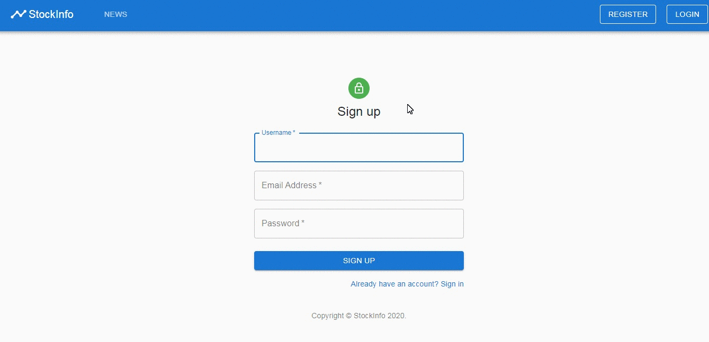

# Stock-info - project summary
## Table of contents
* [Description](#description)
* [Technologies used](#technologies-used)
* [Setup](#setup)
* [Demo](#demo)
## Description
Stock-info is a school project for the subject Web programming on the Faculty of Computer Science and Engineering - Skopje. The project is a web application about news and information. This is the server-side application.  
Filip Petrushevski  
Student ID number: 171516
## Technologies used
- Spring Boot Application
- PostgreSQL database
- JWT authentication
## Setup
- Install PostgreSQL database and any database management studio(I used pgAdmin)
- Set a password for the user postgres and update the value for spring.datasource.password in the `src/main/resources/application.properties` file
- Create a database named `stock-info` with connection at port 5432 (if you create it at another port update spring.datasource.url at application.properties)
- Note: This application uses external APIs that can be accessed only if you have an API Key which you can get by creating a free account at their page. Therefore, to get the stock data you would need to register at the following websites and update the application.properties fields stock-info.app.newsApiKey and stock-info.app.finnhubKey with the corresponding values.  
The websites of the external API are:  
https://finnhub.io/  
https://newsapi.org/
- After these steps you are ready to install the maven dependencies and run the application with any GUI that supports Java Spring Boot application, or with `mvn spring-boot:run` command run in the root directory if you have maven installed.
## Demo
